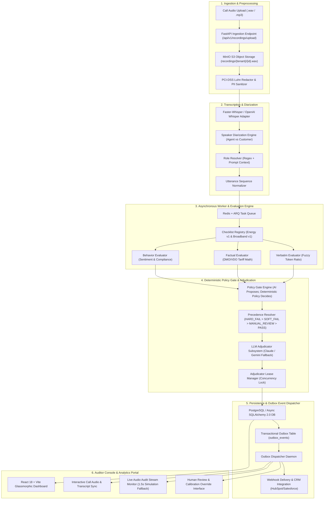

<div align="center">

# 🎙️ SalesCall QA Platform — AI Post-Sale Compliance & Audit Infrastructure

[](https://github.com/YATHARTHH/ai-sales-call-qa-platform/actions)
[](https://pytest.org/)
[](https://python.org)
[](https://fastapi.tiangolo.com)
[](https://react.dev)
[](https://postgresql.org)
[](LICENSE)

> **Automated post-call compliance scoring and live stream auditing for regulated Australian Energy (AER, DMO/VDO, EIC) and Telecommunications (ACMA) telesales. Enforces zero-tolerance regulatory compliance with deterministic gate policy precedence.**

</div>

---

> [!IMPORTANT]
> **Core Architecture Imperative**: *"AI Proposes; Deterministic Policy Decides."*
> Every gate decision is computed by a pure-Python deterministic policy engine over immutable input snapshots (`input_snapshot_json`). AI models (Whisper, Claude, Gemini) propose scores and transcript findings, but final compliance verdicts (`HARD_FAIL`, `SOFT_FAIL`, `MANUAL_REVIEW`, `PASS`) are strictly determined by auditable policy rules.

---

## 📚 Complete Enterprise Documentation Suite

Explore the complete 9-part technical documentation system in [`docs/`](file:///d:/ai-sales-call-qa-platform/docs/):

| Module Document | Scope & Focus Areas |
| :--- | :--- |
| **[01. Project Vision & Requirements](file:///d:/ai-sales-call-qa-platform/docs/01_project_vision_usecases_and_requirements.md)** | Telesales compliance origin story, the 5 core problems solved, Australian regulatory frameworks (AER, EIC, DMO/VDO, ACMA), and core performance metrics. |
| **[02. System Architecture & ADRs](file:///d:/ai-sales-call-qa-platform/docs/02_system_architecture_and_tech_stack.md)** | End-to-end 6-tier architecture diagram, technology stack trade-off matrix, and formal Architecture Decision Records (ADR-001 to ADR-005). |
| **[03. Data Model & Storage](file:///d:/ai-sales-call-qa-platform/docs/03_data_model_telemetry_and_storage.md)** | Relational PostgreSQL schema, ER diagram, immutable snapshot JSON serialization (`input_snapshot_json`), and MinIO object storage structure. |
| **[04. Security & Active Enforcement](file:///d:/ai-sales-call-qa-platform/docs/04_security_threat_model_and_active_enforcement.md)** | STRIDE threat matrix, in-flight PCI-DSS Luhn algorithm card redaction, statutory compliance boundaries, and `AdjudicatorLease` concurrency locking. |
| **[05. Evaluation Engine & Policy Gates](file:///d:/ai-sales-call-qa-platform/docs/05_evaluation_engine_policy_gates_and_adjudication.md)** | Verbatim, Factual, and Behavior evaluators, Policy Gate precedence (`HARD_FAIL > SOFT_FAIL > MANUAL_REVIEW > PASS`), LLM adjudication fallbacks, and calibration. |
| **[06. Developer Onboarding & Testing](file:///d:/ai-sales-call-qa-platform/docs/06_developer_onboarding_codebase_and_testing.md)** | Step-by-step developer environment setup, complete repository file map, `.env` configuration, seed data scripts, and Pytest command reference. |
| **[07. Deployment, CI/CD, & SRE](file:///d:/ai-sales-call-qa-platform/docs/07_deployment_cicd_scalability_and_sre.md)** | Docker Compose configuration, Kubernetes horizontal worker scaling (Redis ARQ), CI/CD pipelines, and SRE operational alerting playbooks. |
| **[08. API, Events, & Webhooks](file:///d:/ai-sales-call-qa-platform/docs/08_api_events_and_integration_reference.md)** | REST API endpoint specification, WebSocket / SSE event streaming formats, and transactional outbox webhook event payloads. |
| **[09. Interview Prep & FAQ](file:///d:/ai-sales-call-qa-platform/docs/09_interview_prep_glossary_and_faq.md)** | Architectural deep-dive Q&A, Australian telesales compliance glossary (DMO, VDO, EIC, ACMA, AER), and system engineer FAQ. |
| **[10. Complete System Architecture Walkthrough](file:///d:/ai-sales-call-qa-platform/docs/10_complete_system_architecture_walkthrough.md)** | Comprehensive 6-module architecture walkthrough covering Boxes 1 to 6 and supporting infrastructure in plain language. |

---

## ⚡ Key Capabilities at a Glance

```text
┌─────────────────────────────────────────────────────────────────────────────────────────────────┐
│                                     KEY SYSTEM CAPABILITIES                                     │
├────────────────────────────┬───────────────────────────────────┬────────────────────────────────┤
│ Feature Module             │ Capabilities & Description        │ Key Architecture Components    │
├────────────────────────────┼───────────────────────────────────┼────────────────────────────────┤
│ 1. Deterministic Policy    │ Enforces immutable gate           │ GateEngine, CheckVersion,      │
│    Gate Engine             │ precedence rules over snapshot    │ PrecedenceResolver             │
│                            │ evaluations.                      │                                │
├────────────────────────────┼───────────────────────────────────┼────────────────────────────────┤
│ 2. PCI-DSS Luhn Card       │ In-flight mathematical card       │ PCILuhnRedactor, Transcript    │
│    Redaction               │ checksum scrubbing before storage.│ Ingestion Pipeline             │
├────────────────────────────┼───────────────────────────────────┼────────────────────────────────┤
│ 3. DMO/VDO Tariff Math     │ Factual tariff comparison vs AER  │ FactualEvaluator, TariffMath,  │
│    Verification            │ reference price caps ($/day, c/kWh)│ RateCardResolver              │
├────────────────────────────┼───────────────────────────────────┼────────────────────────────────┤
│ 4. Transactional Outbox    │ At-least-once CRM webhook event   │ OutboxEventRepository,         │
│    Dispatcher              │ delivery without DB lock blocking.│ OutboxDispatcherDaemon         │
├────────────────────────────┼───────────────────────────────────┼────────────────────────────────┤
│ 5. Live Stream Audit       │ Near-real-time audio audit with   │ LiveStreamMonitor, WebSocket / │
│    Monitor                 │ 1.5s local simulation fallback.   │ Local Simulation Fallback      │
└────────────────────────────┴───────────────────────────────────┴────────────────────────────────┘
```

---

## 📐 End-to-End System Architecture



---

## 🚀 Quick-Start Guide

### 1. Backend Setup
```bash
# Clone repository
git clone https://github.com/YATHARTHH/ai-sales-call-qa-platform.git
cd ai-sales-call-qa-platform

# Create and activate virtual environment
python -m venv .venv
.\.venv\Scripts\Activate.ps1    # Windows
# source .venv/bin/activate     # macOS/Linux

# Install package dependencies
pip install -e .

# Run FastAPI backend development server
uvicorn apps.api.main:app --reload --port 8000
```

### 2. Frontend Web Portal Setup
```bash
cd apps/web
npm install
npm run dev
# Open http://localhost:5173/ in browser
```

### 3. Run Test Suite
```bash
# Run pytest unit & integration tests
pytest

# Run Gold-Set accuracy harness
python scripts/measure_accuracy.py
```

---

## 📄 License
This project is licensed under the MIT License — see the [LICENSE](LICENSE) file for details.
