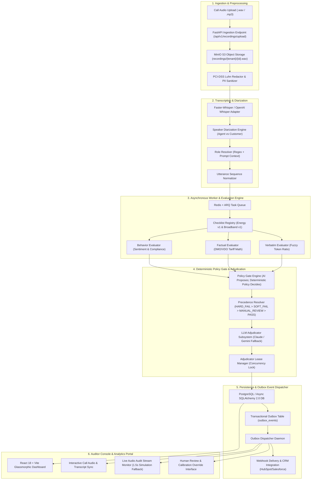

# SalesCall QA Platform System Architecture, Tech Stack Justifications, & Architecture Decision Records (ADRs)

Welcome to **Document 02**! This document provides the complete, production-grade architectural specification of the SalesCall QA Platform. It features high-resolution system diagrams, detailed tech stack trade-off analyses, and formal **Architecture Decision Records (ADRs)** with plain-language explanations.

---

## 🧭 What is an ADR (Architecture Decision Record)?

> 💡 **Simple Analogy**: Imagine building an airliner. You must decide: *"Should the fuselage be built from aluminum or carbon composite?"* You choose carbon composite for fuel efficiency and strength. To prevent future maintenance crews from replacing parts with aluminum without understanding why, you record an official note: **"We selected carbon composite to achieve 15% fuel reduction while meeting structural stress requirements."**

In software engineering, an **ADR** is that exact record. It documents:
1. **Context**: What problem or constraint were we facing?
2. **Decision**: What technology, pattern, or architecture did we select?
3. **Consequences**: What benefits did we gain, and what trade-offs did we accept?

---

## 1. End-to-End System Architecture Diagram

---

## 2. Technology Stack Justification & Trade-Off Matrix

| Component | Selected Technology | Alternative Evaluated | Why We Selected It | Trade-Off Accepted |
| :--- | :--- | :--- | :--- | :--- |
| **API Layer** | FastAPI (Python 3.11+) | Django / Flask | Async I/O support for high-concurrency websocket & streaming endpoints, native Pydantic v2 validation. | Requires explicit async database driver handling (`asyncpg`). |
| **Database** | PostgreSQL + Async SQLAlchemy 2.0 | MongoDB / DynamoDB | ACID guarantees, complex JSONB query support for evaluation trees, strict relational integrity. | Requires Alembic migration management. |
| **Object Storage** | MinIO S3 API | Local Filesystem | S3 API compatibility allowing seamless transition to AWS S3/GCS in production without code edits. | Requires running a lightweight MinIO service container locally. |
| **Task Queue** | Redis + ARQ | Celery + RabbitMQ | Lightweight async Python native task queue, zero heavy dependencies, sub-millisecond execution overhead. | Less UI tooling out-of-the-box compared to Flower/Celery. |
| **Web Frontend** | React 18 + Vite | Next.js / Vue | Fast HMR development speed, modular SPA architecture, lightweight bundle footprint. | Requires explicit client-side routing setup. |

---

## 3. Architecture Decision Records (ADRs)

### ADR-001: Deterministic Policy Engine Over Raw LLM Gate Decisions
* **Status**: Accepted
* **Context**: LLMs used directly to assign "PASS" or "FAIL" to sales calls exhibit non-deterministic variance (hallucinations), changing verdicts across identical reruns.
* **Decision**: We enforce the principle **"AI Proposes; Deterministic Policy Decides"**. Evaluators generate item-level scores and confidence values, but final compliance verdicts are computed by a pure-Python deterministic `GateEngine` evaluating strict precedence (`HARD_FAIL > SOFT_FAIL > MANUAL_REVIEW > PASS`).
* **Consequences**: 100% reproducible compliance verdicts and auditable gate logic.

### ADR-002: Dual Storage (PostgreSQL Relational + MinIO S3 Audio)
* **Status**: Accepted
* **Context**: Storing binary audio files directly inside PostgreSQL causes database bloat and degrades query performance.
* **Decision**: Store audio files as immutable objects in MinIO/S3 (`recordings/{tenant_id}/{call_id}.wav`) and store metadata, transcripts, and evaluation trees in PostgreSQL.
* **Consequences**: Scalable audio storage and high-speed database queries.

### ADR-003: Transactional Outbox Pattern for Webhook Dispatching
* **Status**: Accepted
* **Context**: Sending webhooks directly inside HTTP request handlers causes database lock contention and potential event loss if downstream CRMs are temporarily offline.
* **Decision**: Persist outbox events inside the database transaction (`outbox_events`) and process them asynchronously via a dedicated worker daemon.
* **Consequences**: Zero event loss, guaranteed at-least-once webhook delivery.

### ADR-004: Pure-Python Rule Evaluator Engine with Modular Extensions
* **Status**: Accepted
* **Context**: Compliance requirements vary between industries (e.g., Energy Retail vs Broadband).
* **Decision**: Create an abstract `BaseEvaluator` class and modular checklist builders (`EnergyRetailerV1`, `BroadbandRetailerV1`).
* **Consequences**: Adding new checklists or industries requires zero changes to core pipeline logic.

### ADR-005: Local Simulation Fallback for Live Audit Monitoring
* **Status**: Accepted
* **Context**: WebSocket connections in local demo environments can fail due to local firewall policies or proxy restrictions.
* **Decision**: Implement a 1.5-second connection handshake timeout in `LiveStreamMonitor.tsx` that automatically falls back to an offline local simulation.
* **Consequences**: Guarantees bulletproof live demo execution regardless of local browser/network conditions.

---

> [!NOTE]
> Proceed to **[Document 03: Data Model & Storage](file:///d:/ai-sales-call-qa-platform/docs/03_data_model_telemetry_and_storage.md)** to examine database schemas and object storage structures.
