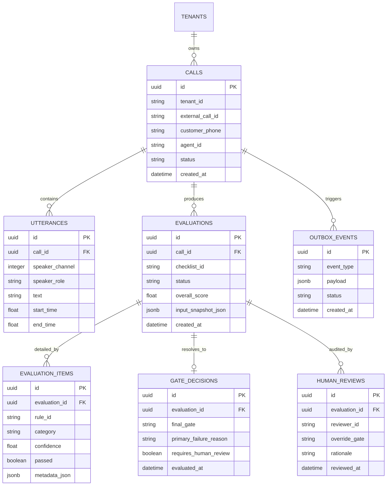

# SalesCall QA Platform Data Model, Telemetry, & Storage Subsystem

Welcome to **Document 03**! This document provides the complete database schema specification, entity-relationship diagrams, object storage organization, and snapshot immutability guarantees of the SalesCall QA Platform.

---

## 1. Entity-Relationship (ER) Diagram



---

## 2. Core Relational Schemas

### `calls` Table
Stores primary telesales call metadata and raw audio reference paths.

| Column | Type | Constraints | Description |
| :--- | :--- | :--- | :--- |
| `id` | UUID | Primary Key | Canonical call identifier |
| `tenant_id` | VARCHAR(64) | Indexed, Not Null | Multi-tenant organization identifier |
| `external_call_id` | VARCHAR(128) | Indexed | Telephony PBX system call ID |
| `audio_s3_key` | VARCHAR(512) | Not Null | S3 URI pointing to raw audio in MinIO |
| `status` | VARCHAR(32) | Default 'PENDING' | Status: `PENDING`, `TRANSCRIBED`, `EVALUATED`, `FAILED` |

### `evaluations` Table
Stores top-level evaluation execution runs.

| Column | Type | Description |
| :--- | :--- | :--- |
| `id` | UUID | Primary Key |
| `call_id` | UUID | Foreign Key -> `calls.id` |
| `checklist_id` | VARCHAR(64) | Active checklist identifier (`energy_retailer_v1`, `broadband_v1`) |
| `overall_score` | FLOAT | Computed weighted compliance score (0.0 to 100.0) |
| `input_snapshot_json` | JSONB | **Immutable** copy of all utterances, checklist definitions, and system parameters |

### `gate_decisions` Table
Stores deterministic gate policy outcomes.

| Column | Type | Description |
| :--- | :--- | :--- |
| `id` | UUID | Primary Key |
| `evaluation_id` | UUID | Foreign Key -> `evaluations.id` |
| `final_gate` | VARCHAR(32) | Final verdict (`PASS`, `MANUAL_REVIEW`, `SOFT_FAIL`, `HARD_FAIL`) |
| `requires_human_review`| BOOLEAN | True if gate requires manual auditor review |

---

## 3. Immutable Snapshot Serialization (`input_snapshot_json`)

To guarantee **100% deterministic reproducibility**, every evaluation run serializes its exact input parameters into `evaluations.input_snapshot_json`:

```json
{
  "call_id": "4b492ed8-df29-4b23-a740-4aca0cbfa1dd",
  "checklist_version": "1.2.0",
  "utterances": [
    {"speaker": "AGENT", "text": "This call is recorded for quality assurance.", "start": 0.5, "end": 3.2},
    {"speaker": "CUSTOMER", "text": "Yes, I understand and consent.", "start": 3.5, "end": 5.1}
  ],
  "policy_thresholds": {
    "hard_fail_score": 50.0,
    "manual_review_confidence": 0.75
  }
}
```

When an auditor triggers an **Audit Rerun**, the platform re-evaluates `input_snapshot_json` instead of fetching live database states, guaranteeing identical scoring under matching engine versions.

---

## 4. MinIO Object Storage Structure

All binary audio files are organized in MinIO following strict multi-tenant isolation:

```text
minio-bucket/
└── recordings/
    ├── tenant_econnex_01/
    │   ├── call_20260919_1001.wav
    │   └── call_20260919_1002.wav
    └── tenant_origin_02/
        └── call_20260919_2001.wav
```

---

> [!NOTE]
> Proceed to **[Document 04: Security & Threat Model](file:///d:/ai-sales-call-qa-platform/docs/04_security_threat_model_and_active_enforcement.md)** to examine PCI-DSS redaction and compliance enforcement.
