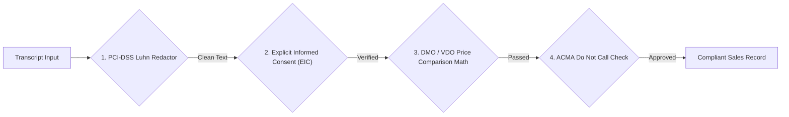

# SalesCall QA Platform Security, Threat Model, & Active Compliance Enforcement

Welcome to **Document 04**! This document details the security architecture, threat vector analyses (STRIDE), PCI-DSS payment card redaction, Australian statutory safeguards, and concurrency lease management.

---

## 1. STRIDE Threat Model Analysis

```text
┌─────────────────────────────────────────────────────────────────────────────────────────────────┐
│                                     STRIDE THREAT MATRIX                                        │
├───────────────────┬───────────────────────────────────┬─────────────────────────────────────────┤
│ Threat Category   │ Risk Description                  │ Mitigation Mechanism                    │
├───────────────────┼───────────────────────────────────┼─────────────────────────────────────────┤
│ Spoofing          │ Unauthorized API client uploads   │ API Key authentication header           │
│                   │ fake call recordings.             │ (`X-API-Key`) + Tenant ID validation.   │
├───────────────────┼───────────────────────────────────┼─────────────────────────────────────────┤
│ Tampering         │ Altering evaluation results in    │ Immutable `input_snapshot_json` +       │
│                   │ database to bypass compliance.    │ transactional audit outbox logging.     │
├───────────────────┼───────────────────────────────────┼─────────────────────────────────────────┤
│ Repudiation       │ Sales agent denies misquoting     │ Original raw audio archived in MinIO + │
│                   │ DMO rates during call.            │ timestamp-synchronized transcript.      │
├───────────────────┼───────────────────────────────────┼─────────────────────────────────────────┤
│ Information       │ Spoken credit card numbers leak   │ In-flight PCI-DSS Luhn algorithm        │
│ Disclosure        │ into persistent transcript text.  │ redaction before database commit.       │
├───────────────────┼───────────────────────────────────┼─────────────────────────────────────────┤
│ Denial of Service │ Massive audio upload flood to     │ Payload size cap (50MB) + rate limiting │
│                   │ exhaust transcription workers.    │ on upload endpoint.                     │
├───────────────────┼───────────────────────────────────┼─────────────────────────────────────────┤
│ Elevation of      │ Auditor overrides compliance      │ RBAC auditor permissions +              │
│ Privilege         │ gate without authorization.       │ mandatory rationale audit trails.       │
└───────────────────┴───────────────────────────────────┴─────────────────────────────────────────┘
```

---

## 2. PCI-DSS Payment Card Redaction (Luhn Checksum Algorithm)

To prevent Payment Card Industry (PCI-DSS) non-compliance fines, all audio transcripts pass through an in-flight **Luhn Redactor** before being saved to PostgreSQL:

1. **Regex Pattern Extraction**: Scans transcript text for sequences of 13 to 19 digits.
2. **Luhn Algorithm Checksum Verification**:
   $$\sum_{i=1}^{n} d_i' \equiv 0 \pmod{10}$$
   where $d_i'$ doubles every second digit from right to left (subtracting 9 if $> 9$).
3. **Redaction**: Valid card numbers are immediately overwritten with `[CARD_REDACTED_PCI_DSS]`.

```python
def redact_pci_card_numbers(text: str) -> str:
    """Scans text for candidate digit sequences and redacts Luhn-valid card numbers."""
    def is_luhn_valid(card_num: str) -> bool:
        digits = [int(d) for d in card_num if d.isdigit()]
        checksum = 0
        reverse_digits = digits[::-1]
        for idx, digit in enumerate(reverse_digits):
            if idx % 2 == 1:
                doubled = digit * 2
                checksum += doubled - 9 if doubled > 9 else doubled
            else:
                checksum += digit
        return checksum % 10 == 0

    import re
    candidates = re.findall(r'\b(?:\d[ -]*?){13,19}\b', text)
    for cand in candidates:
        clean = re.sub(r'\D', '', cand)
        if is_luhn_valid(clean):
            text = text.replace(cand, "[CARD_REDACTED_PCI_DSS]")
    return text
```

---

## 3. Australian Regulatory Compliance Enforcers



---

## 4. Auditor Concurrency Locking (`AdjudicatorLease`)

To prevent race conditions when multiple QA auditors review the same failed call simultaneously, the platform enforces atomic lease fencing:

```text
Auditor A                PostgreSQL DB                Auditor B
    │                         │                           │
    ├─── Acquire Lease ──────►│ (granted lease_ttl=300s)  │
    │    (Success)            │                           ├─── Acquire Lease
    │                         │                           │    (REJECTED: 409 Conflict)
    ├─── Submit Override ────►│ (processed atomically)    │
    └─── Release Lease ──────►│ (lease cleared)           │
```

---

> [!NOTE]
> Proceed to **[Document 05: Evaluation Engine & Policy Gates](file:///d:/ai-sales-call-qa-platform/docs/05_evaluation_engine_policy_gates_and_adjudication.md)** to examine the rule evaluation and gate precedence algorithms.
