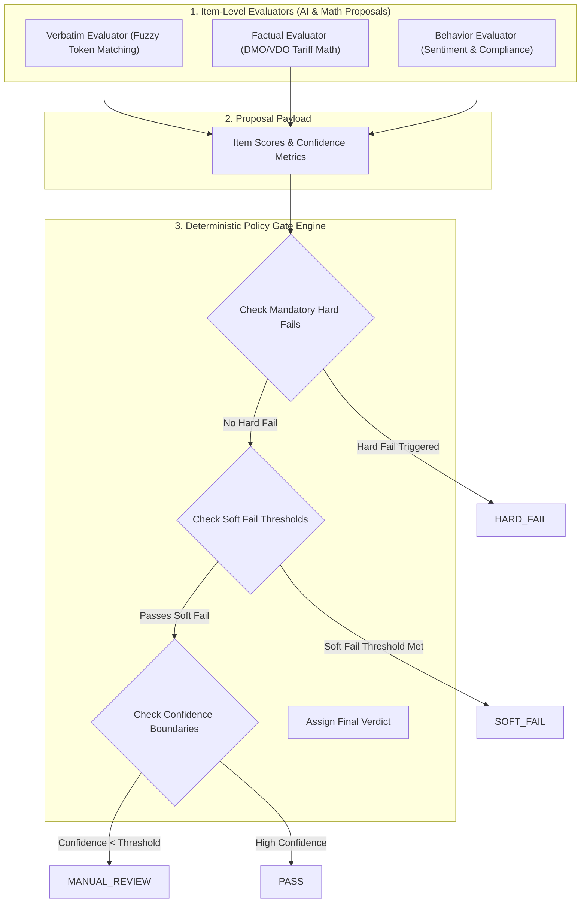

# SalesCall QA Platform Evaluation Engine, Policy Gates, & LLM Adjudication

Welcome to **Document 05**! This document explains the core evaluation engine, rule evaluators, deterministic gate precedence logic, LLM adjudication fallbacks, and calibration sampling algorithms.

---

## 1. Core Principle: "AI Proposes; Deterministic Policy Decides"

The central design imperative of the SalesCall QA Platform is:

> **"AI Proposes; Deterministic Policy Decides."**

* **AI & Evaluators Propose**: Neural evaluators (fuzzy match, tariff math, sentiment classification) inspect transcripts and produce item-level scores ($s_i \in [0.0, 1.0]$) and confidence metrics ($c_i \in [0.0, 1.0]$).
* **Deterministic Policy Decides**: A pure-Python `GateEngine` evaluates item outcomes against strict, auditable threshold precedence rules to compute final compliance verdicts.



---

## 2. Rule Evaluator Pipeline

### 1. Verbatim Evaluator (`packages/evaluation/evaluators/verbatim.py`)
Validates exact or near-exact required disclosure phrases spoken by agents (e.g. *"This call is recorded for quality and compliance purposes"*):
* Uses **Fuzzy Token Sort Ratio** to account for natural spoken variations:
  $$\text{Score} = \frac{\text{LevenshteinDistance}(\text{Target}, \text{Actual})}{\max(\text{len}(\text{Target}), \text{len}(\text{Actual}))}$$

### 2. Factual Evaluator (`packages/evaluation/evaluators/factual.py`)
Enforces financial accuracy in tariff quotes against official AER DMO/VDO reference prices:
* **DMO Reference Price Math**:
  $$\text{Calculated Variance \%} = \frac{\text{Quoted Rate} - \text{DMO Base}}{\text{DMO Base}} \times 100$$
* If the agent quotes $18\%$ discount but math yields $12\%$, the item fails with `PASSED = False`.

### 3. Behavior Evaluator (`packages/evaluation/evaluators/behavior.py`)
Monitors agent tone, active listening, and proper handling of customer objections.

---

## 3. Policy Gate Precedence Rules

The `GateEngine` resolves item-level evaluation outputs into a single canonical gate verdict following immutable precedence:

$$\text{Verdict} = \text{HARD\_FAIL} \succ \text{SOFT\_FAIL} \succ \text{MANUAL\_REVIEW} \succ \text{PASS}$$

| Gate Verdict | Trigger Condition | Consequence |
| :--- | :--- | :--- |
| **`HARD_FAIL`** | Any mandatory legal rule fails (e.g., EIC disclosure missing, PCI card leaked) | Zero call score; immediate CRM alert; sales submission blocked. |
| **`SOFT_FAIL`** | Non-mandatory item fails (e.g., agent omitted greeting or branding statement) | Deducts weighted points from overall score; flagged for coaching. |
| **`MANUAL_REVIEW`** | Item evaluation confidence $< 0.75$ or ambiguity threshold met | Routed to QA Auditor console queue for human review. |
| **`PASS`** | All mandatory and secondary compliance rules pass with high confidence | Call approved automatically; CRM sale confirmed. |

---

## 4. LLM Adjudication Subsystem

For edge cases where automated fuzzy rules yield ambiguous confidence scores ($0.50 \le c_i < 0.75$), the platform invokes an **LLM Adjudicator** (Claude 3.5 Sonnet or Gemini 2.5 Flash):

```text
               Ambiguous Item (Confidence < 0.75)
                                │
                                ▼
                   ┌──────────────────────────┐
                   │  LLM Adjudicator Factory │
                   └────────────┬─────────────┘
                                │
         ┌──────────────────────┴──────────────────────┐
         ▼                                             ▼
┌──────────────────────────┐               ┌──────────────────────────┐
│  Claude 3.5 Adjudicator  │               │   Gemini 2.5 Adjudicator │
│  (Primary API Provider)  │               │    (Fallback Provider)   │
└────────────┬─────────────┘               └────────────┬─────────────┘
             │                                          │
             └──────────────────┬───────────────────────┘
                                │
                                ▼
                 Structured JSON Adjudication:
                 - Recommended Verdict (PASS/FAIL)
                 - Explanation Rationale
                 - Citation Utterance ID
```

---

## 5. Calibration Sampling & Accuracy Regression Testing

To prevent rule drift over time, the platform includes automated calibration scripts:

* **Accuracy Harness** (`scripts/measure_accuracy.py`): Runs evaluations against a Gold-Set standard (`tests/fixtures/gold/energy_gold_set_v1.json`).
* **Confusion Matrix**:
  $$\text{Precision} = \frac{TP}{TP + FP}, \quad \text{Recall} = \frac{TP}{TP + FN}, \quad F_1 = 2 \cdot \frac{\text{Precision} \cdot \text{Recall}}{\text{Precision} + \text{Recall}}$$

---

> [!NOTE]
> Proceed to **[Document 06: Developer Onboarding](file:///d:/ai-sales-call-qa-platform/docs/06_developer_onboarding_codebase_and_testing.md)** to set up your local development environment.
