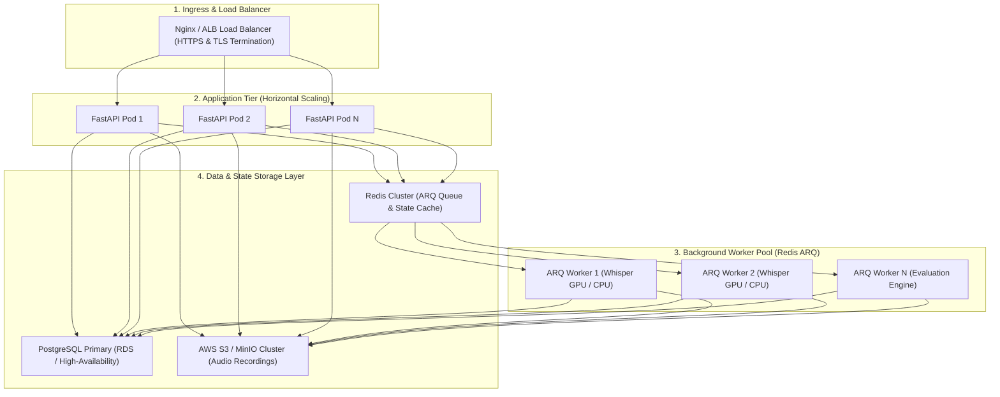

# SalesCall QA Platform Deployment, CI/CD, Scalability, & SRE

Welcome to **Document 07**! This document provides production deployment architectures, Docker configurations, horizontal scalability strategies, GitHub Actions CI/CD workflows, and SRE operational playbooks.

---

## 1. Production Deployment Topology



---

## 2. Containerized Deployment (`docker-compose.yml`)

The platform is containerized for instant local or cloud staging deployment:

```yaml
version: '3.8'

services:
  api:
    build:
      context: .
      dockerfile: apps/api/Dockerfile
    ports:
      - "8000:8000"
    environment:
      - DATABASE_URL=postgresql+asyncpg://postgres:postgres@db:5432/salescall_qa
      - REDIS_URL=redis://redis:6379/0
      - MINIO_ENDPOINT=minio:9000
    depends_on:
      - db
      - redis
      - minio

  worker:
    build:
      context: .
      dockerfile: apps/worker/Dockerfile
    environment:
      - DATABASE_URL=postgresql+asyncpg://postgres:postgres@db:5432/salescall_qa
      - REDIS_URL=redis://redis:6379/0
    depends_on:
      - redis
      - db

  db:
    image: postgres:15-alpine
    environment:
      POSTGRES_DB: salescall_qa
      POSTGRES_PASSWORD: postgres
    ports:
      - "5432:5432"

  redis:
    image: redis:7-alpine
    ports:
      - "6379:6379"

  minio:
    image: minio/minio
    command: server /data --console-address ":9001"
    ports:
      - "9000:9000"
      - "9001:9001"
```

---

## 3. Horizontal Scalability & ARQ Queue Tuning

1. **Worker Autoscaling**: Workers scale dynamically based on Redis queue depth (`arq:queue` length).
2. **Batch Ingestion**: High-volume call uploads trigger chunked background job creation.
3. **Database Connection Pooling**: FastAPI and ARQ workers utilize `asyncpg` connection pools (`max_overflow=20`, `pool_size=10`).

---

## 4. SRE Metrics & Alerting Playbook

| Alert Name | Metric Condition | Priority | Response Action |
| :--- | :--- | :--- | :--- |
| `WorkerQueueBacklog` | Redis queue depth $> 500$ for $> 5$ mins | P2 - Warning | Scale ARQ worker replicas horizontally. |
| `EvaluationErrorSpike` | Evaluation error rate $> 2\%$ over 15 mins | P1 - Critical | Check LLM API key rate limits and fallback provider status. |
| `PostgreSQLPoolExhaustion` | DB connection utilization $> 90\%$ | P1 - Critical | Increase pool max_overflow or scale read-replicas. |

---

> [!NOTE]
> Proceed to **[Document 08: API & Integration Reference](file:///d:/ai-sales-call-qa-platform/docs/08_api_events_and_integration_reference.md)** for endpoint and webhook schemas.
