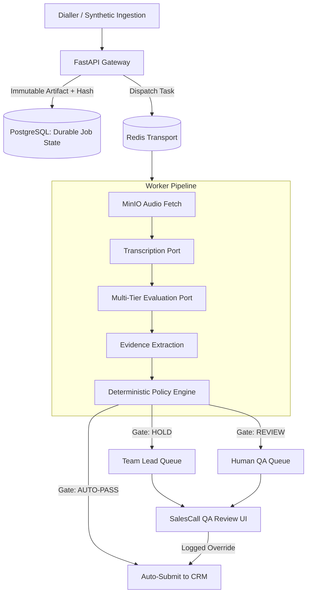

# Architecture Overview — SalesCall QA Platform

## Core Design Philosophy: *"AI Proposes; Deterministic Policy Decides"*

The SalesCall QA platform enforces automated quality assurance and regulatory compliance for sales calls. The system ensures that:
1. **Raw call recordings are immutable source artifacts** tagged with SHA-256 content hashes.
2. **ASR and AI evaluators propose findings** with confidence scores and exact transcript spans.
3. **Deterministic policy engines make the gate decision** (`PASS`, `HOLD`, or `REVIEW_REQUIRED`).
4. **Every result is traceable** to the exact transcript line, audio timestamp, and the check rule version live on the call date.

---

## High-Level Topology

---

## State Machine Separation

| Machine | States | Responsibility |
| :--- | :--- | :--- |
| **PipelineStatus** | `RECEIVED` → `INGESTING` → `TRANSCRIBING` → `TRANSCRIBED` → `EVALUATING` → `EVALUATED` (or `FAILED`) | Tracks operational system progress |
| **GateStatus** | `PENDING` → `PASSED` \| `HELD` \| `REVIEW_REQUIRED` \| `CANCELLED` | Governs compliance business outcome |
