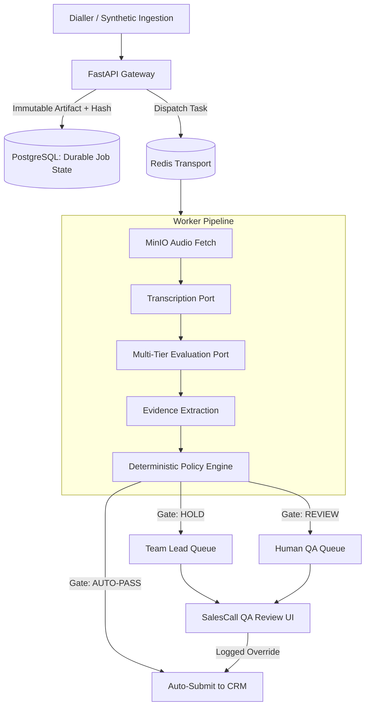

# Architecture Overview — SalesCall QA Platform

## Core Design Philosophy: *"AI Proposes; Deterministic Policy Decides"*

The SalesCall QA platform enforces automated quality assurance and regulatory compliance for sales calls. The system ensures that:
1. **Raw call recordings are immutable source artifacts** tagged with SHA-256 content hashes.
2. **ASR and AI evaluators propose findings** with confidence scores and exact transcript spans.
3. **Deterministic policy engines make the gate decision** (`PASS`, `HOLD`, or `REVIEW_REQUIRED`).
4. **Every result is traceable** to the exact transcript line, audio timestamp, and the check rule version live on the call date.

---

## High-Level Topology

---

## State Machine Separation

| Machine | States | Responsibility |
| :--- | :--- | :--- |
| **PipelineStatus** | `RECEIVED` → `INGESTING` → `TRANSCRIBING` → `TRANSCRIBED` → `EVALUATING` → `EVALUATED` (or `FAILED`) | Tracks operational system progress |
| **GateStatus** | `PENDING` → `PASSED` \| `HELD` \| `REVIEW_REQUIRED` \| `CANCELLED` | Governs compliance business outcome |

---

## Evaluation pipeline

`EvaluationOrchestrator.execute_evaluation` runs ten ordered stages. Each one is pure with respect
to its inputs, so a run can be replayed from its snapshot and reach the same decision.

| # | Stage | Why it is where it is |
| :--- | :--- | :--- |
| 1 | Validate transcript integrity | A transcript with no customer speech, broken ordering or a lineage mismatch can never auto-pass. |
| 2 | Resolve date-effective check versions | Checks resolve to the version in force **on the call date**, filtered by fuel type, customer type, state and campaign. |
| 3 | Build the immutable input snapshot | Canonical JSON, SHA-256 hashed: sale, lead, resolved checks, policy version, evaluator config. |
| 4 | Short-circuit on invalid transcript | Holds before any check runs, so a bad transcript is never scored. |
| 5 | Execute checks via the evaluator registry | Verbatim, factual and behaviour evaluators; an unknown check type yields `UNSUPPORTED`, which holds if critical. |
| 6 | Adjudicate ambiguity | Ambiguous findings only. The model proposes; the policy below decides. |
| 7 | Calculate the weighted score | Zero-denominator guarded; only score-eligible outcomes count. |
| 8 | Create the evaluation run | With full AI provenance and execution metadata. |
| 9 | Evaluate the policy gate | The 11-condition precedence table. |
| 10 | Materialise results and evidence | Every finding grounded to a segment id and a millisecond span. |

### Speaker diarization

Compliance checks are speaker-scoped: a verbatim disclosure must come from the agent, and a
concession confirmation from the customer. Attribution is therefore load-bearing, and the pipeline
prefers an exact signal over a probabilistic one.

1. **Channel separation** (`StereoChannelDiarizer`) — dialler recordings normally place each party
   on its own channel. Per-channel energy over each utterance's span decides the speaker. No model,
   no inference, reproducible.
2. **Model-based** (`PyannoteDiarizer`) — attempted for mono audio when the optional dependency is
   installed.
3. **Neither** — utterances are labelled `SPEAKER_UNKNOWN` and the result reports
   `diarization_provider="none"`. Transcript integrity validation then fails on
   `NO_CUSTOMER_SPEECH_DETECTED` and the gate holds the sale. An undiarised transcript is never
   silently scored as though speaker separation had happened.

### The adjudication boundary

Stage 6 is the only place a language model touches a compliance outcome, and the policy around it
([`adjudication_policy.py`](../packages/evaluation/policy/adjudication_policy.py)) is deliberately
narrow:

- **Only `AMBIGUOUS` findings are eligible.** A deterministic `PASS`, `FAIL`, `NOT_EVALUABLE` or
  `UNSUPPORTED` is never revisited, so a model can neither rescue a failed critical check nor
  overturn a verified one.
- **A proposal may only make a critical outcome stricter.** Turning an unresolved critical check
  into a pass is the one move that could ship a non-compliant sale, so it stays with a human unless
  an operator sets `allow_upgrade_to_pass_on_critical`.
- **Below the confidence threshold, nothing is applied.**
- **Any failure degrades to `CANNOT_DETERMINE`** — an adjudicator outage routes to a human, never
  to a pass.
- **Every applied verdict is recorded as evidence** carrying the provider, model, prompt version
  and confidence, still anchored to a playable timestamp.

With no adjudicator configured the engine is fully deterministic and every ambiguity goes to a
human. That is the default.

### Calibration sampling

Condition 10 of the gate diverts a share of otherwise-clean calls to human QA. Selection is
`sha256(policy_version:sale_id)` bucketed against the rate, so it is a pure function of the sale —
a replayed evaluation reaches the same decision, and reproducibility is preserved. It sits **below**
every blocking condition, so sampling can never overturn a critical failure.

---

## Reporting

Dashboard aggregation lives in
[`analytics_repository.py`](../packages/infrastructure/database/repositories/analytics_repository.py)
and runs in the database layer, not the browser. Two definitions worth stating explicitly:

- **First-pass yield** is the share of sales that auto-submitted with *no* human rework — it counts
  `auto_submitted`, not merely `PASSED`, so a decision a human had to approve does not inflate it.
- **Score with fatal factors** applies the fatal rule: any critical failure zeroes the scorecard.
  **Score without fatal factors** is the plain weighted score. Both are reported side by side.

The weighted score the gate decided on is persisted on `gate_decisions.overall_score` rather than
recomputed, so a dashboard and an audit always report the number the decision was actually made
with.
